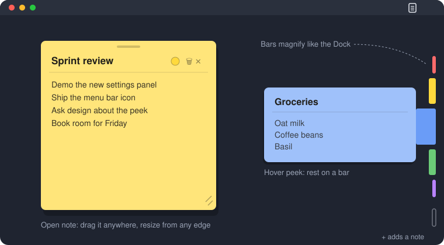

# Snap Notes

**Sticky notes that live on the edge of your screen.** Each note is a thin colored bar docked to the right edge, always on top and never in the way. Hover to magnify the bars like the macOS Dock, rest on one to peek inside, and click to unfold it into a full sticky note.



- **Out of the way:** about 6 px of screen per note. Clicks anywhere else go straight to the apps behind it.
- **One glance away:** peek at any note without opening it.
- **Portable:** a single executable, no installer. Your notes are a JSON file next to it, with their images in an `images/` folder.
- **Cross-platform:** macOS, Windows and Linux.

## What it can do

### The bar strip
- **Dock-style magnification:** move the cursor along the strip and nearby bars grow with smooth spring physics.
- **Hover peek:** rest on a bar and it widens into a small preview with the title, a divider and the first lines. The preview is as wide as the note (its saved width, or the default size), never narrower than 260 px. Move onto the preview to keep it open, and click it to open the note. Its trash button deletes the note after asking first.
- **Quick add:** click the `+` slot below the bars (the whole strip width counts), or press Cmd/Ctrl+N.
- **Search:** click the 🔍 slot under `+`, press Cmd/Ctrl+F or choose **Search…** in the tray menu. See [Search](#search).
- **Reorder:** drag a bar up or down to move the note.
- **Scroll:** with more notes than fit on screen, scroll the strip with the mouse wheel.

### Notes
- **Unfold and fold:** a click morphs the bar into a sticky note. Esc, the close button, a click outside the note or a click on its bar folds it back.
- **Title and body:** each note has a title header and a scrolling body. The scrollbar only appears once the text overflows.
- **Move it anywhere:** drag the grip at the top. The note reopens where you left it, and double-clicking the grip docks it again.
- **Resize it:** drag any edge or corner. Each note remembers its own size.
- **Color code it:** pick from a 20-color palette with the swatch in the header.
- **Delete with confirmation:** the trash button asks first, then folds the note away.
- **Copy:** the copy button in the header copies the note's title and body. Its icon shows a ✓ for a moment afterwards.
- **Images:** drop a png, jpg, gif or webp file (up to 20 MB) onto an open note, paste an image-only clipboard with Cmd/Ctrl+V, or use the image button in the toolbar.
- **Clickable links:** `http`, `https` and `mailto` links in the formatted view open in your browser.

### Look and feel
- **Inter and Lucide:** the interface uses the Inter typeface and a Lucide icon set, so text and icons look the same on every platform.
- **Dark mode:** follows the system appearance and switches live while the app runs.
- **Paper notes:** a softer paper tone derived from the bar color, with layered shadows, a top highlight and an adhesive band. Text keeps WCAG AA contrast in light and dark.
- **Tab-like bars:** bars have a gradient and a highlight, and the open note's bar is wider, like a tab.
- **Motion:** a deleted note's bar collapses, the toolbar fades and slides in, the body fades when you switch modes, and buttons have pressed states.
- **Details:** a focus ring on the title, a faint "…" in empty notes and slimmer scrollbars.

### Search
- **Open it:** Cmd/Ctrl+F, the 🔍 slot under `+` in the strip, or **Search…** in the tray menu. Esc closes the panel.
- **As you type:** results update with every keystroke. Matching ignores case and covers titles and bodies.
- **Results:** each one shows the title and a snippet with the match in bold. Click one to open that note with the match selected, or press Enter to open the first one.
- **Dimmed bars:** while you type, the bars of notes that don't match dim.

### Export
- **Open it:** **Export…** in the Settings group "Data", or in the tray menu.
- **Pick notes:** every note starts checked. The All and None buttons toggle them all.
- **Format:** `.md` or `.txt`, saved as one file through a save dialog. The suggested name is `snap-notes-YYYY-MM-DD.<ext>`.
- **Markdown:** each note becomes a `# Title` heading followed by its Markdown. The custom color, size and highlight tags are removed. Single line breaks stay line breaks (as a trailing double space), except in code blocks.
- **Plain text:** each title is underlined with `=`.

### Formatting
Notes are written in Markdown plus a few color and size tags. An open note shows the formatted text. Click the body to edit the raw Markdown, and click the title or press Esc to return to the formatted view. A second Esc folds the note. Empty notes open straight in edit mode. While editing, the editor already shows bold, italic, code, colored text and bold headings, with the Markdown markers drawn faint. Bold, italic and colors that span several lines of a paragraph show on each of those lines, as in the formatted view. Strikethrough, highlight backgrounds, sizes and images only show in the formatted view. In edit mode the toolbar's bold, italic, strikethrough, code, text color, highlight, size (small, normal, large, huge), link and image buttons apply the markup.

| Effect | Syntax |
|---|---|
| Bold / italic / strikethrough | `**bold**`, `*italic*`, `~~struck~~` |
| Inline code | `` `code` `` |
| Heading | `# H1` … `### H3` (H4–H6 render as H3) |
| Lists | `- item`, `1. item`, nested by indentation |
| Task | `- [ ] open`, `- [x] done` (click the checkbox to toggle it) |
| Quote / rule / code block | `> quote`, `---`, fenced ```` ``` ```` |
| Link | `[text](https://example.com)` or `<https://example.com>` |
| Image | `` (PNG, JPEG, GIF or WebP) |
| Text color | `{coral}text{/}` or `{#FF0000}text{/}` |
| Highlight | `{bg:amber}text{/}` or `==text==` |
| Font size | `{size:20}text{/}` (8–48) |
| Literal brace | `\{` |

- **Color names:** `coral`, `rose`, `blush`, `peach`, `tangerine`, `amber`, `lemon`, `sand`, `lime`, `sage`, `mint`, `teal`, `aqua`, `sky`, `cornflower`, `periwinkle`, `lavender`, `orchid`, `mocha`, `slate`. They follow your palette in Settings, while hex colors stay fixed.
- **Tags nest:** `{coral}{size:20}big red{/} red{/}`. `{/}` closes the innermost tag, and an unclosed tag ends with its paragraph.
- **Highlight with `==`:** only when it hugs the text (`==word==`), so `a == b` stays as typed.
- **Line breaks:** a single newline stays a line break.
- **Raw HTML:** shows as typed and is never rendered.
- **Older notes:** keep their text, but a line indented by 4 spaces now shows as a code block, and a line followed by `---` as a heading.

### Settings
Open them from the menu bar/tray icon or with Cmd/Ctrl+,. Every change applies live and is saved automatically, and each group except Data has a Reset button. There is no theme setting: dark mode follows the system.

| Group | What you can adjust |
|---|---|
| App | Show or hide the menu bar/tray icon and the Dock icon/taskbar button. At least one always stays visible. |
| Bars | Width, height and gap |
| Hover | Magnification, how far it spreads, and the peek delay (0–3 s) |
| Notes | Default size, paper tint (lighter/darker than the bar), and how faint the header controls are until you hover |
| Motion | Animation speed (0.25–3×) |
| Window | How much of the screen height the strip may use |
| Palette | Replace any of the 20 note colors from 60 presets. Notes using the old color follow along. |
| Data | **Export…** your notes to one file (see [Export](#export)) |

### Menu bar / tray
On macOS and Windows a small icon offers **Show/Hide Notes**, **New Note**, **Search…**, **Export…**, **Settings…** and **Quit**. Hiding the notes clears the screen completely until you show them again.

## Keyboard shortcuts

| Shortcut | Action |
|---|---|
| Cmd/Ctrl+N | New note |
| Cmd/Ctrl+F | Open or close search |
| Cmd/Ctrl+, | Open or close settings |
| Cmd/Ctrl+V | Paste an image into the open note |
| Enter | Open the first search result (in the search field) |
| Esc | Leave edit mode, close search, export or settings, or fold the open note |

The Cmd/Ctrl shortcuts also work while you type in a note's title or body or in the search field.

## Platform support

| | macOS | Windows | Linux |
|---|---|---|---|
| Bar strip, peek, notes, settings | ✓ | ✓ | ✓ |
| Click-through around the strip | ✓ | ✓ | The window shrinks to the strip instead |
| Menu bar / tray icon | ✓ | ✓ | – (the strip has a settings slot instead) |
| Hide Dock icon / taskbar button | ✓ | ✓ | – |
| Single instance | – | ✓ | – |

## Your data

Notes are stored in `notes.json` and settings in `settings.json`, next to the executable. Images added to notes live in an `images/` folder next to them. Edits save automatically, with a 500 ms debounce and atomic writes, so a crash never leaves a half-written file. A hand-edited `settings.json` with a typo keeps every valid value and falls back to defaults only for the broken ones. At startup, images that no note references are deleted from `images/`, except when `notes.json` fails to load.

To move Snap Notes to another machine, copy the executable together with both JSON files and the `images/` folder.

## Install

Every push to `main` builds Snap Notes for **Windows x64, macOS arm64, Linux x64 and Linux arm64**. Download the binary from the build artifacts in [Actions](https://github.com/FabianRiegsinger/snap-notes/actions), or build it yourself:

```bash
cargo build --release
./target/release/snap-notes
```

The release binary is optimized for size (`opt-level = "z"`, LTO, stripped). Linux builds need `pkg-config`, `libxkbcommon-dev`, `libwayland-dev` and `libfontconfig1-dev`.

## Under the hood

- **Rust** with [iced](https://iced.rs) 0.14 (wgpu rendering)
- A custom bar-strip widget with Gaussian magnification and critically damped springs
- [`tray-icon`](https://crates.io/crates/tray-icon) for the menu bar/tray icon, plus native calls for click-through and Dock/taskbar visibility (AppKit on macOS, Win32 on Windows)
- [`pulldown-cmark`](https://crates.io/crates/pulldown-cmark) for Markdown, with a small tag layer on top for color, highlight and size
- [Inter](https://rsms.me/inter/) 4.1 (SIL OFL 1.1) and [Lucide](https://lucide.dev) icons (ISC), both bundled as subsets. `assets/fonts/subset.sh` regenerates the subsets.
- JSON persistence with lenient loading and atomic writes

## License

MIT
